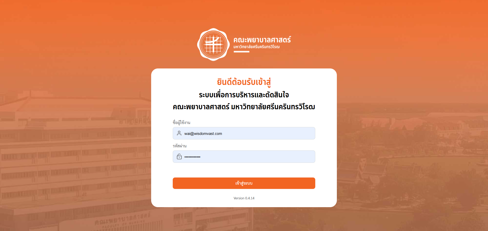

# Academic & Personnel Management System

## Introduction
A modernized **Academic & Personnel Management System** with integrated **reporting dashboards**, built with **Nuxt 3, Vue 3 Composition API, TypeScript, and TailwindCSS**.  

This project helps streamline **academic services, personnel information, research tracking, and reporting**, while offering role-based authentication and a user-friendly interface.

---


<p align="center">
  <a href="https://raw.githubusercontent.com/nithasp/swu-nurse-database/master/screenshots/sc1.png" target="_blank">
    
  </a>
  <a href="https://raw.githubusercontent.com/nithasp/swu-nurse-database/master/screenshots/sc2.png" target="_blank">
    
  </a>
</p>


---

## ✨ Features
- **Dashboard Modules**: Academic, personal, and research dashboards with data visualizations.  
- **Personnel Management**: Contracts, history, emergency contacts, education, and roles.  
- **Academic Services**: Course management, agency and branch information, position & leave types.  
- **Research Work**: Manage articles, books, intellectual property, and reports.  
- **Reports & Analytics**: Export, print, and compare data with chart visualizations.  
- **Authentication & Roles**: Secure login and role-based access for different users.  

---

## 🛠 Tech Stack
- **Frontend**: Nuxt 3, Vue 3 (Composition API), TypeScript  
- **Styling**: TailwindCSS, custom components  
- **Data Visualization**: Chart.js  
- **Backend Integration**: RESTful APIs (academic, personnel, research, reporting)  
- **Other Tools**: Prettier, ESLint  

---

## 🚀 Installation
```bash
# Clone the repository
git clone https://github.com/nithasp/swu-nurse-database

# Navigate to project folder
cd your-project

# Install dependencies
npm install

# Run development server
npm run dev

# Build for production
npm run build
```

---